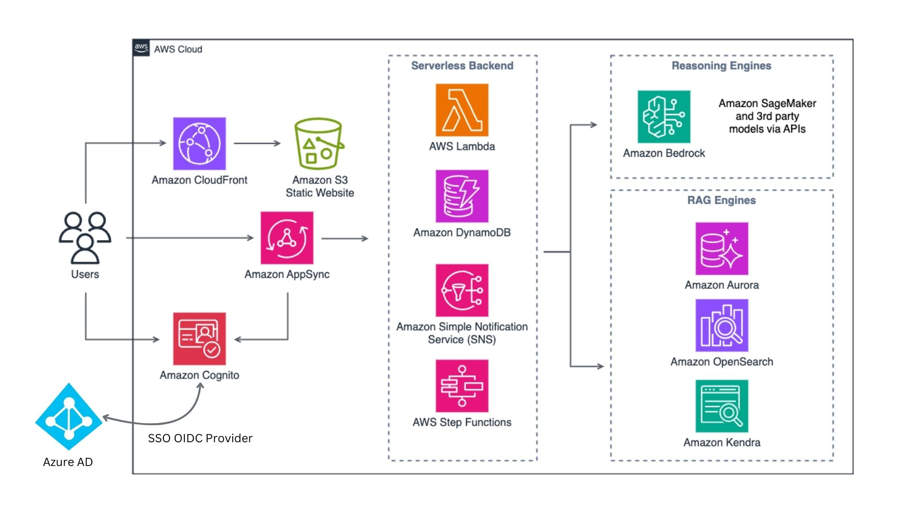

# EOTSS GenAI Sandbox README

## Overview

The GenAI Sandbox is designed to empower Massachusetts state agency employees with varying technical proficiencies to effectively utilize AI technologies. It addresses the challenges of accessibility, system integration, and ethical concerns while enhancing operational efficiency, service delivery, and innovation within public sector operations.

## Sandbox Features

### Chatbot Playground
The Chatbot Playground provides a safe environment for users to experiment with different Large Language Models (LLMs). Users can test various models, customize parameters (e.g., TopP, temperature), and observe how different configurations affect model responses. This feature is ideal for gaining hands-on experience with AI models and understanding their capabilities.

### Multi-Chat Playground
The Multi-Chat Playground enhances the Chatbot Playground by allowing users to query 2-4 models simultaneously. This feature facilitates efficient comparison of results on a single screen, helping users to evaluate and select the best model for their specific needs.

### Smart Model
The Smart Model feature enhances AI responses by leveraging advanced algorithms and a dedicated context management system. It automatically decides which model to use based on various factors such as task requirements, cost, efficiency, token size, and model capabilities. This ensures that beginner users can focus on their tasks without needing in-depth knowledge of model specifications.

### Smart Navigation
Smart Navigation, or the Task Carousel, offers a pre-filled prompt system to assist users in completing specific tasks, enhancing user experience and productivity. It automates prompt engineering, enabling users to concentrate on tasks without the need to craft detailed prompts.

### Workspaces
Workspaces function like a file system within the AI Sandbox, allowing users to create and manage multiple private workspaces. Each workspace can be configured with different Retrieval-Augmented Generation (RAG) engines, such as Aurora, OpenSearch, and Kendra. Users can upload multiple documents to their workspaces and perform queries using the RAG setup.

### Retrieval-Augmented Generation (RAG)
The RAG setup allows users to upload documents and perform search queries, ensuring accurate and relevant information retrieval tailored to user needs. This feature enhances the ability to find and utilize critical information from large datasets efficiently.

## Architecture

For more information, visit the [AWS GenAI LLM Chatbot](https://aws-samples.github.io/aws-genai-llm-chatbot/).

## Deployment Guide
[Guide link](https://github.com/aschwarzer101/EOTSS-AWS-Secret-Project/blob/main/docs/guide/deploy.md)

## Developers

- [Alayna Schwarzer](https://www.linkedin.com/in/alayna-schwarzer/)
- [Dhruv Kamalesh Kumar](https://www.linkedin.com/in/dhruvkamaleshkumar)
